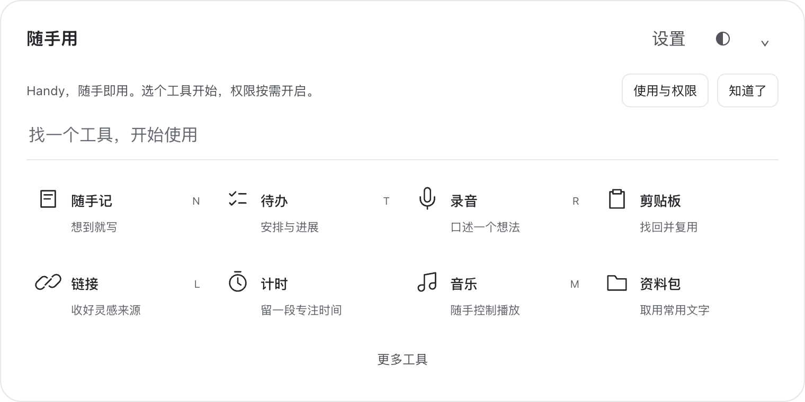

# Handy


**随手即用。一个方便、快捷的 macOS 本地工具启动器。**

想到就记，需要就开，用完收起。按快捷键从屏幕底部唤出，搜索或选择工具，直接在同一面板使用，不必再找应用、开小窗、选择第二遍。

[下载 v1.0.0](https://github.com/jilombmiker-alt/Handy/releases/tag/v1.0.0) · [使用说明](docs/USER-GUIDE.md) · [工具组合](#工具可以怎样组合) · [反馈问题](https://github.com/jilombmiker-alt/Handy/issues)



## 最开始，为什么做它？

我们想解决的不是“再造一套完整办公软件”，而是很小却频繁的需求：突然想到一句话、临时口述一个想法、找回刚复制的内容、收藏一个链接、给下一件事计时。

**便捷使用，是产品最初也是现在的定位。**

- 入口要近：快捷键唤出，工具直接可用。
- 操作要少：先记录和使用，分类与整理按需展开，不强迫填复杂表单。
- 功能要适度：满足临时和日常需要；长文档、完整会议系统、复杂项目管理交给专用工具。
- 决定权在用户：AI 帮忙梳理，不替用户设目标，不悄悄更改安排。
- 用完不打扰：收起只保留菜单栏入口；切换工具不中断录音和计时。

## 工具有哪些？

首屏保留 8 个常用入口；其他工具从“更多工具”或搜索进入。

| 工具 | 适合做什么 |
| --- | --- |
| 随手记 | 一条想法一条记录，随时追加；结束时顺手确认，可转为笔记或待办 |
| 待办 | 记录今天、本周或未来安排，按时段推进，回看完成情况、进展和下一步 |
| 录音 | 口述想法、实时转写、标记重点；保留原音频与逐字稿，可选结束后整理 |
| 剪贴板 | 搜索找回近期复制内容，快速复用；保存整段 SOP 或固定片段，按需转存 |
| 链接 | 随手收藏、备注、自建分组、标记常用、关联笔记；可选 AI 内容提炼 |
| 计时 | 倒计时或正计时，一键开始，到点轻提醒，结束后保留用时记录 |
| 音乐 | 汽水音乐快捷控制；需客户端与权限就绪，不自动播放 |
| 资料包 | 收纳提示词、文字模板、固定步骤和文件引用，复制或确认后粘贴 |

更多工具包含笔记库、会前草稿整理、已有窗口查找与分组、参考图对照、画廊、账号密钥和多邮箱。它们按需使用，不要求先配置完所有模块。

## 工具可以怎样组合？

组合的价值是少切换、少重复录入，不是让所有工具自动执行。

| 场景 | 组合 | 怎么用 |
| --- | --- | --- |
| 突然有个想法 | 录音 → 随手记 → 待办 | 主动口述，结束后保留录音并收录为随手记；准备实施时确认加入待办 |
| 临时讨论 | 随手记＋录音＋计时 | 记关键词、标重要处，按需设讨论时长；可选择到点结束已绑定的这段录音 |
| 写作与灵感 | 随手记＋链接＋参考图 | 先写想法，把参考网址关联到笔记，图片按需对照 |
| 日常推进 | 待办＋计时 | 从事项进入计时，回看实际用时；完成与进展由自己确认 |
| 学习与跨应用工作 | 窗口分组＋笔记＋剪贴板 | 把已打开的浏览器、聊天与资料窗口分组，快速切换并转存片段 |
| 每周想法回看 | 随手记＋待办 | 回看未实施的想法，选“周末看看／下周再看”，决定后再加入安排 |

在“更多工具 → 窗口 → 内部工具组合”可使用临时讨论、写作、日常推进预设，也可自定义。组合在**同一个面板**列出工具入口，不批量弹出小窗；外部窗口分组只切换已存在的窗口，不自动启动一组软件。

## 快速上手

1. 下载 `Handy-1.0.0-arm64.dmg`，将 `Handy.app` 放入“应用程序”。当前包适用于 Apple Silicon Mac。
2. 手动打开 Handy 会显示工具启动器；首次提示可以关闭，不要求先完成授权。之后可从菜单栏或默认 **左 Option＋左 Command** 短按后松开唤出；设置中可更换快捷键。登录自启动保持收起。
3. 选择工具直接使用。展开并聚焦时，默认 `N` 随手记、`T` 待办、`R` 录音、`L` 链接、`M` 音乐；输入框中打字不会触发工具键。
4. 先试随手记或手动待办，无需配置 AI。剪贴板默认关闭，按需启用后默认 **Option＋V** 唤出，可修改。
5. 用完收起，下次继续；纯白与黑曜石主题可随时切换。

首次设置、保存方式、快捷键及权限恢复见 [使用说明](docs/USER-GUIDE.md)。

## 数据、AI 与权限

- 笔记、待办、录音与设置保存在本机，没有自建后端或云同步；兼容历史应用身份与数据目录，不因显示名改变而清空数据。
- AI 需自行配置服务与 API Key。待办 AI 默认关闭，关闭时原样记录；开启后主动请求，建议确认才写入。录音自动整理可关闭，整理失败保留已保存的音频和转写。
- 转写会向配置的语音服务发送音频，文字整理发送该功能使用的文本。链接预览访问公开网站，邮箱和音乐有各自服务要求；“本地存储”不等于所有功能离线。
- 密钥通过 Electron `safeStorage` 加密或从环境变量读取，不随源码提供。麦克风与摄像头仅主动操作后启用，结束使用或退出时释放。
- 当前 DMG 使用 **ad-hoc 临时签名，未经过 Apple 公证**。首次启动可能被拦截，覆盖新构建后可能需要重新授权或填写凭据。应用提供打开设置、重新检测与完全重启，不自动清除 TCC。
- 权限帮助位于设置页上方。辅助功能、麦克风、摄像头仅在主动点击后申请；屏幕权限通过系统设置确认，重新检测不会启动捕获。“在访达定位当前应用”定位实际运行的安装包，不用猜路径。若从 DMG／下载目录运行，会提示先放入“应用程序”再授权，不自动覆盖安装。

> v1.0.0 安装包包含首次启动与权限恢复入口。当前开发者电脑已确认安装包可打开，重启 macOS 后系统搜索恢复；这不是全新用户验收，也不代表每台电脑都需要重启。其他 Mac 的首次下载、Gatekeeper 和真实授权流程仍需按实际环境验证。

## v1.0 的边界

以当前工具启动器重新建立 **v1.0.0** 发布基线，不是功能倒退。仓库只保留这一基线的提交与发布，不再陈列旧版流水记录。

- 音乐目前以汽水快捷控制为主，不含完整曲库、内嵌选歌或全部平台适配；曲名和状态不可获取时不伪造。
- 邮件是 QQ、163、Gmail、iCloud 的按需只读入口，不是完整邮箱客户端；未接入 Google OAuth，需满足服务商授权条件。
- AI 与转写速度、质量依赖服务和网络，重要内容应核对。没有自动发言人分离或完整自动会议纪要系统。
- 外部窗口查找需系统权限，不支持任意第三方窗口持续置顶。
- 周回看是想法确认步骤，不是自动周报；通知依赖应用运行及系统状态。
- 自动化回归覆盖核心逻辑和隔离界面，不代替每个真实服务、客户端和硬件的验收。

## 从源码运行

需要 macOS、Node.js 20+、npm；原生扩展需要 Xcode Command Line Tools。桌面端为 Electron 33＋原生 HTML/CSS/JavaScript，无渲染层构建步骤。

```bash
npm ci
npm start
```

```bash
npm test
npm run test:launcher
```

开发临时包（可能需要重新授权）：

```bash
PANEL_ALLOW_ADHOC_SIGNING=1 npm run build
```

已有有效 Developer ID 时可用 `PANEL_DEVELOPER_ID` 指定；构建通过不等于 Apple 公证完成。开发进程不要和正式应用同时运行。

`main.js` / `main-*.js` 负责桌面服务，`preload.js` 为安全桥接，`renderer/` 为工具界面，`native/` 为原生扩展，`tests/` 为测试。`website/` 保留独立历史网站源码，不作为当前桌面功能说明，本次不重新部署网站。

## License

[MIT](LICENSE)。仓库地址与应用显示名统一为 **Handy**。
